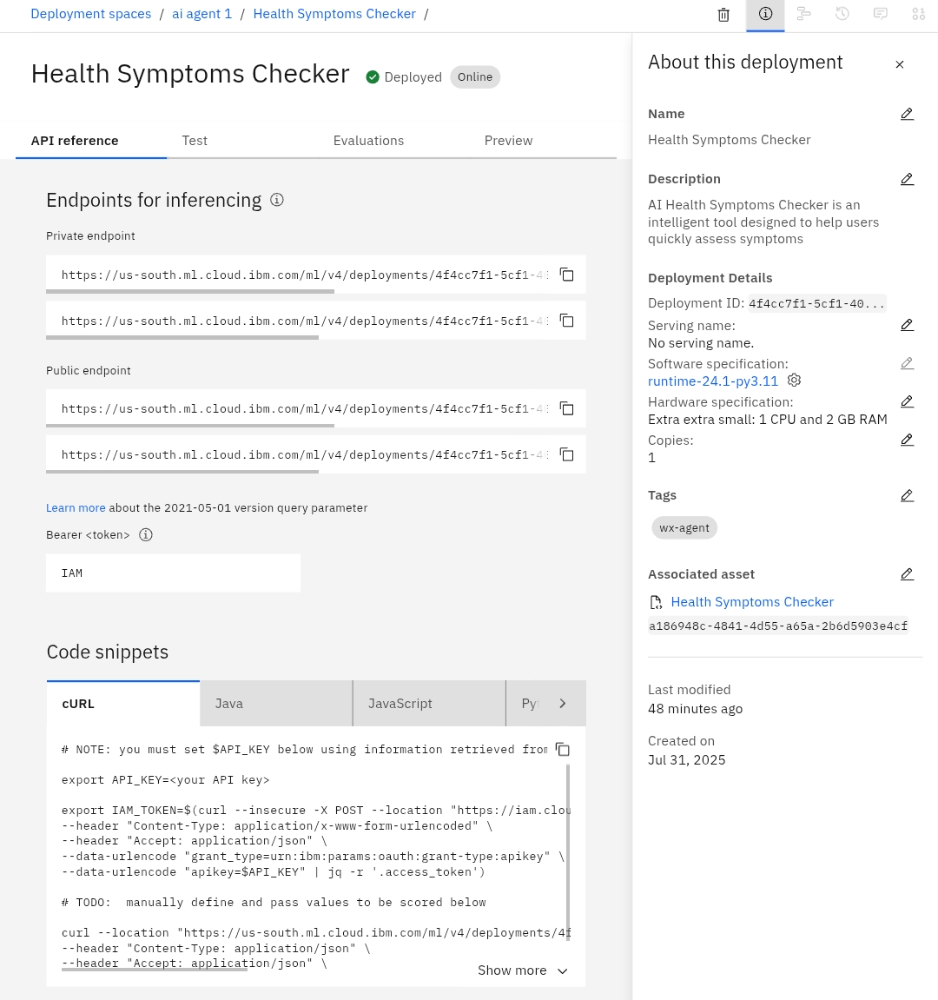

# Health-Synptoms-Checker-Agent
This project is a Health Symptom Checker Agent built using IBM watsonx.ai. The agent uses AI to provide general, first-level advice for common health symptoms and basic first aid. Users can ask questions such as “I have a sore throat and mild fever, what should I do?” and the agent offer help

## Screenshots

### IBM watsonx.ai Project Dashboard

### Deployment/API Reference Screen

### Agent Assets or Prompt Lab Screenshot

### Prompt/Chat Example with Agent

